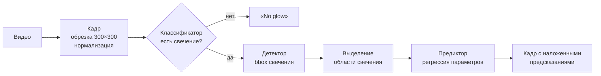
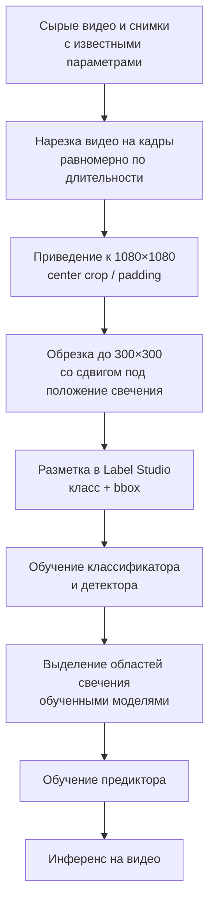

# GlowAnalysis

**Компьютерное зрение для промышленной установки: оценка физических параметров режима по видео свечения рабочей зоны.**


> [!NOTE]
> Это открытая версия кода проекта, выполненного для промышленного заказчика.
> Данные, обученные веса и сведения об установке являются закрытыми и в репозиторий не включены.
> Код опубликован с согласия заказчика.

---

## Задача

В ходе работы установки в её рабочей зоне возникает свечение, форма, яркость и положение которого зависят от
режима работы. Параметры режима (электрические: напряжение и ток) контролируются приборами, но есть потребность
оценивать их **бесконтактно, по видеопотоку с камеры**.

Цель проекта — система, которая принимает на вход видео и для каждого кадра:

1. определяет, есть ли в кадре свечение;
2. локализует область свечения;
3. предсказывает значения физических параметров режима.

Основные сложности:

- **очень тёмные кадры** — свечение занимает небольшую часть изображения и бывает едва различимым на фоне шумов матрицы;
- **малый объём данных** — съёмки проводятся сессиями, каждая сессия даёт ограниченное число записей;
- **разные условия съёмки** — от сессии к сессии меняется положение свечения в кадре;
- **нет готовой разметки** — её пришлось организовывать с нуля.

## Решение

Задача декомпозирована на каскад из трёх нейросетей на базе **ResNet18** (transfer learning с весов ImageNet):



| Модель | Задача | Архитектура | Функция потерь |
|---|---|---|---|
| **Классификатор** | наличие свечения в кадре (glow / no_glow) | ResNet18, `fc → 2` | Cross-Entropy |
| **Детектор** | регрессия bounding box области свечения | ResNet18 backbone + MLP-голова `512 → 256 → 4` | `α·MSE + β·(1 − IoU)` |
| **Предиктор** | регрессия физических параметров режима | ResNet18, `fc → 2` | MSE |

Почему каскад, а не одна модель:

- классификатор отсекает пустые кадры, чтобы регрессор не выдавал «параметры» там, где свечения нет;
- детектор позволяет выделить область свечения и убрать из входа предиктора фон и шумы, что важно на тёмных кадрах;
- каждую модель можно дообучать и валидировать отдельно, а в разметке нужен только bbox и класс.

### Ключевые детали реализации

- **Комбинированная функция потерь для детектора** — MSE по координатам даёт стабильный градиент на старте,
  IoU-составляющая напрямую оптимизирует качество перекрытия боксов.
- **Аугментации с учётом bbox** (Albumentations): небольшие сдвиги, масштаб, повороты и изменение
  яркости/контраста с синхронным преобразованием разметки.
- **Нормализация по статистике датасета** — среднее и std считаются по собственным данным
  ([preprocess/data_info.py](preprocess/data_info.py)), а не берутся из ImageNet: кадры почти чёрные,
  и стандартные значения сильно искажают распределение.
- **Визуальный контроль обучения** — каждые N эпох детектор рисует на случайных примерах
  истинный и предсказанный боксы ([labels/detector_train_check.py](labels/detector_train_check.py)),
  лоссы сохраняются в CSV и визуализируются ([loss_analysis.py](loss_analysis.py)).
- **Датасеты по сессиям съёмки** — данные хранятся и размечаются отдельно по датам, чтобы ошибка
  в одной сессии не портила весь набор, а состав обучающей выборки легко менялся.

## Пайплайн данных

Помимо моделей, в проекте реализован полный цикл подготовки данных — от сырых видео до обученных весов.



Для разметчиков написана пошаговая инструкция: [label_studio_instruction.md](label_studio_instruction.md).
Подробная схема пайплайна со ссылками на конкретные скрипты — [info_images/sample_pipeline.jpg](info_images/sample_pipeline.jpg).

## Структура репозитория

```
GlowAnalysis/
├── main.py                  # интерактивный CLI: весь цикл от подготовки данных до обучения
├── paths.py                 # пути к данным и моделям
├── preprocess/              # подготовка данных
│   ├── video_to_images.py       # нарезка видео на кадры
│   ├── image_preprocessing.py   # приведение к 1080×1080
│   ├── image_resizing.py        # обрезка до рабочего размера
│   ├── prepariring_for_labeling.py  # сборка шагов в один пайплайн
│   └── data_info.py             # mean/std датасета для нормализации
├── labels/                  # загрузка разметки Label Studio и её визуализация
├── train/                   # обучение моделей
│   ├── classifier_train.py
│   ├── detector_train.py
│   └── predictor_train.py
├── inference/               # применение моделей
│   ├── image_processing.py      # выделение областей свечения для предиктора
│   ├── video_processing.py      # покадровая обработка видео всем каскадом
│   └── video_resizing.py        # обрезка входного видео
├── utils/                   # создание структуры каталогов под новую сессию данных
├── training_data/           # (закрыто) данные по сессиям съёмки
└── trained_models/          # (закрыто) веса моделей
```

## Запуск

```bash
pip install torch torchvision opencv-python albumentations pillow pandas matplotlib seaborn label-studio
python main.py
```

`main.py` проводит по всем этапам в интерактивном режиме: создание структуры каталогов для новой сессии,
предобработка, пауза на разметку, обучение классификатора и детектора, подготовка данных и обучение предиктора.

Обработка видео обученным каскадом — [inference/video_processing.py](inference/video_processing.py):
на выходе видео, где на каждом кадре выделена область свечения и подписаны предсказанные параметры.

> Без исходных данных и весов код запускается только на собственных данных в аналогичной структуре
> (см. [training_data/README.md](training_data/README.md)).

## Стек

- **ML:** PyTorch, torchvision (ResNet18, `box_iou`), Albumentations
- **CV и данные:** OpenCV, Pillow, NumPy, pandas
- **Разметка:** Label Studio
- **Анализ:** matplotlib, seaborn

## Моя роль

Проект выполнен мной самостоятельно: постановка задачи совместно с заказчиком, сбор и организация данных,
организация разметки и инструкция для разметчиков, проектирование архитектуры каскада, обучение и
валидация моделей, инференс на видео.
