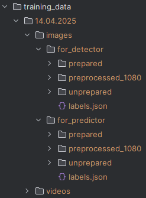

Директория для обучающих данных  
Предполагаемая иерархия:  

Обучающие изображения с параметрами должны находиться в training_data/dd.mm.yyyy/images/for_predictor/unprepared  
Обучающие видео должны находиться в training_data/dd.mm.yyyy/videos  

Изображения с параметрами и изображения с видео разделены.  
Это сделано из-за того, что они могли быть получены из разных видео,   следовательно, свечения на этих изображениях могут находиться в разных местах на изображениях,   а это может усложнить процесс обрезки видео. 

Directory for all the data  
Supposed hierarchy view:  

Images with parameters goes to training_data/images/for_detector/unprepared  
Videos goes just to training_data/videos

images with parameters and without are separated   
because they can be extracted from different videos   
and its general cropping can be difficult